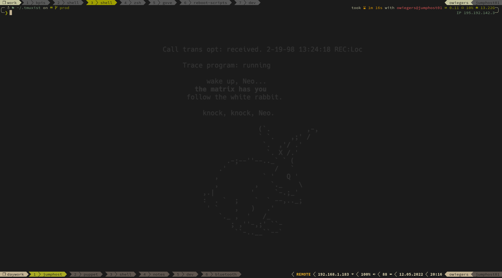

# .tmuxist

Tmux configuration to use local and remote sessions nested. It is possible to
disable the local prefix key by pressing F12 to use the prefix key for the
remote session.

*Disclaimer:* This config -> [gpakosz/.tmux](https://github.com/gpakosz/.tmux)
is a great peace of work. All features contained in this repositories config
are contained in the config made by gpakosz. Including fancy animations and many
more features useful for local tmux sessions. If that's what you're looking for
give that config a try.
The main feature of this repositories config that sets the both apart is the
remote session awareness.

The configuration and custom functions are mostly selfcontained. Nonetheless the
config uses plugins to manage sessions. For more information see the [plugins
section](#plugins).

## Visuals




The top image is a screenshot of tmux with only a local session open.

The lower image is a screenshot of tmux running a local session with a nested
remote session.
On the right side of the lower status bar the remote keymap indicator can be
seen.
This tells you that the local prefix key is deativated and if pressed is
directly picked up by the remote session.

The colors are tweaked to resemble the 
[gruvbox](https://github.com/morhetz/gruvbox) theme.

## Features

### Enabled TMUX Features

- Emacs bindings in command mode.
- Vi mode.

### Custom Features

- [Urlview](https://github.com/sigpipe/urlview) to open URLs in Browser
- Pane sync indicator 
- Hostname / Username indicator
  - Turns red if User is root
- Nested remote session awareness
  - Indicator if remote keymap is active
  - Local keymap can be disabled to issue commands to remote session
- For local tmux instance:
  - Network status / local IP
  - Battery status
  - Pulseaudio volume
- SSH Agent restoring on rempote host
- Copy to system clipboard
- Paste from system clipboard

### Remote session awareness

That means that you can use the same config on your remote system and on your
local system.

- Same keybindings
- Remote status bar on top / local status bar on bottom
- `F12` as toogle key for the local keymap so every keystroke is send to the
  remote session

On the left side of status-right left from the sync indicator is an indicator
that tells you wether the keymap is turnded on or off. The indicator looks like
the following:


### Plugins

- [tmux-resurrect](https://github.com/tmux-plugins/tmux-resurrect) for session
  management.
- [tmux-continuum](https://github.com/tmux-plugins/tmux-continuum) for automatic
  session saving.

### Custom Keybindings

#### Default Mode

- `F12` toggle local prefix key
- `<prefix> U` launch Urlview (if installed)
- `<prefix> e` open tmux window with vim to edit .tmux.conf.local and reload
  config afterwards
- `<prefix> r` reload config
- `<prefix> H` resize current pane to the left
- `<prefix> L` resize current pane to the right
- `<prefix> J` resize current pane downwards
- `<prefix> K` resize current pane upwards
- `<prefix> v` split vertically
- `<prefix> -` split horizontally
- `<prefix> x` kill current pane
- `<prefix> S` syncronize panes in window
- `<prefix> c` create new window
- `<prefix> Tab` focus last window
- `<prefix> Enter` enter copy mode
- `<prefix> p` paste from paste buffer
  - If system clipboard has content paste buffer will be set to that content.
    Or in other words: Paste from system clipboard
- `<prefix> b` list copy buffers
- `<prefix> P` list copy buffers and choose one to paste from

#### Copy Mode

- `<prefix> ESC` exit copy mode
- `<prefix> q` exit copy mode
- `<prefix> v` begin selection
- `<prefix> V` begin line wise selection
- `<prefix> C-v` begin rectangle selection
- `<prefix> y` copy selection and exit copy mode
  - Will copy to tmux buffer and system clipboard.
- `<prefix> v` begin selection

## Installation

You can simply use the install script to create some symlinks.

```bash
cd ~
git clone --recursive https://github.com/chrootzius/.tmuxist.git
./.tmuxist/install.sh
```

Or you can use fancy gnu stow (which does pretty much the same)

```bash
cd ~
git clone --recursive https://github.com/chrootzius/.tmuxist.git
cd .tmuxist/
stow tmux
```

Than start tmux :)

```bash
# General
tmux

# 256 color support
tmux -2
```

## Configuration

**Do not unter any circumstances edit [.tmux.conf](./tmux/.tmux.conf).**

To override any settings and functions or add anything to the configuration
stick to [.tmux.conf.local](./tmux/.tmux.conf.local) for changes to apply to
local and remote sessions. Either to override existing settings from
[.tmux.conf](./tmux/.tmux.conf) or add anything new.

To override any settings and functions or add anything to the configuration that
only applies to remote sessions stick to
[.tmux.conf.local](./tmux/.tmux.conf.local).

### Tmux Settings

- For local and remote settings stick to `.tmux.conf.local`
- For settings that apply to ssh sessions only stick to `.tmux.conf.remote`

To ignore changes you make to those files you can make git ignore these files
until you revert that change. To do so do the following:

```bash
git update-index --skip-worktree tmux/.tmux.conf.local
git update-index --skip-worktree tmux/.tmux.conf.remote
```

For more information see [this stackoverflow
post](https://stackoverflow.com/questions/4348590/how-can-i-make-git-ignore-future-revisions-to-a-file).

### Custom Functions

All functions that reside in [.tmux.conf](./tmux/.tmux.conf) can be overwritten.
This is especially useful if you use proprietary tools for example in house
solutions for connection to remote hosts.

To override a function add a function with the function name added with
`_override` to [.tmux.conf.local](./tmux/.tmux.conf.local). For exmaple To
override the `_hostname` funtion add the function `_hostname_override`.

In the default hostname / username functions used to display those in the status
bar the ssh connections are taken into account. This does of course not work if
the command used is not the usual ssh command. So you could override the
hostname function like this:

```bash
_hostname_override() {
    tty=${1:-}
    hostname="$(ps -t "${tty}" -o user=WIDEOUTPUTFORLONGNAME -o pid= -o ppid= -o command= | awk '((/govm / || /gove /)) {print $6}')"
    if [ -n "${hostname}" ]; then
        printf '%s' "${hostname}"
    else
        tty_stats="$(_tty_stats "${tty}")"
        cmdline="${tty_stats#*:}"
        cmdline="${cmdline#*:}"
        if _is_ssh "${cmdline}";then
            ssh_stats="$(_ssh_stats "${cmdline}")"
            printf '%s' "${ssh_stats##*:}"
        else
            printf '%s' "$(uname -n)"
        fi
    fi
}
```

The above example takes ssh wrappers named `govm` and `goct` to enter VMs and
containers into account.

### Remote SSH Configuration

In [.tmux.conf.remote](./tmux/.tmux.conf.remote) the `SSH_AUTH_SOCK` tmux
environment variable is set to `$HOME/.ssh/ssh_auth_sock`. This is needed so
tmux uses the same ssh socket everytime.
Meaning if your ssh connection to the remote target is lost and you reconnect,
your ssh agent uses still the right socket and is operational.

For this to work you need to add the following to your `~/.ssh/rc` on the remote
target.

```bash
if test "$SSH_AUTH_SOCK"; then
  ln -sf "$SSH_AUTH_SOCK" ~/.ssh/ssh_auth_sock
fi
```

Furthermore the `~/.ssh/rc` is a shell script. For it to work the first line
hast to be:

```bash
#!/bin/bash
```

As long as you do this your ssh connection can break all it wants and you can
reconnect everytime resulting in a working ssh agent on the remote target.

## Testing

```bash
docker build -t tmux_test .
docker run -v "${PWD}/:/root" -it tmux_test
```

## Development

In the [development](./development) folder is a Makefile present. By using
`make dev` the configuration [tmux/.tmux.conf](./tmux/tmux.conf) will be
duplicated into the development folder and split up into two files - the tmux
config and the bash code for the custom functions.
This makes it possible to tweak the bash code in normal fashion.

```bash
git clone --recursive https://github.com/chrootzius/.tmuxist.git
cd .tmuxist/development
make dev
```
