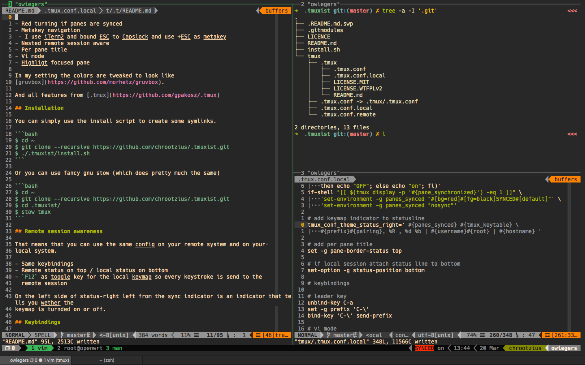

# .tmuxist

> Tmux for work

*Disclaimer:* The main features and main work are done by
[gpakosz](https://github.com/gpakosz/.tmux). I only added a few features, so the
config fits my workflow.
Shoutout to [@gpakosz](https://twitter.com/gpakosz).

## Features

- Red turning indicator if panes are synced
- Metakey navigation
 - I use iTerm2 and bound ESC to Capslock and use +ESC as metakey
- Nested remote session aware
- Per pane title
- Vi mode
- Highligt focused pane

In my setting the colors are tweaked to look like
[gruvbox](https://github.com/morhetz/gruvbox).

And all features from [.tmux](https://github.com/gpakosz/.tmux)



## Installation

You can simply use the install script to create some symlinks.

```bash
$ cd ~
$ git clone --recursive https://github.com/chrootzius/.tmuxist.git
$ ./.tmuxist/install.sh
```

Or you can use fancy gnu stow (which does pretty much the same)

```bash
$ cd ~
$ git clone --recursive https://github.com/chrootzius/.tmuxist.git
$ cd .tmuxist/
$ stow tmux
```

## Remote session awareness

That means that you can use the same config on your remote system and on your 
local system.

- Same keybindings
- Remote status on top / local status on bottom
- `F12` as toogle key for the local keymap so every keystroke is send to the
  remote session

On the left side of status-right left from the sync indicator is an indicator 
that tells you wether the keymap is turnded on or off.

## Keybindings

 - `C-\` as prefix key
 - `v` begin selection in visual mide
 - `y` copy selection in visual mode
 - `<prefix> s` toggle pane sync
 - `Meta-h` select left pane
 - `Meta-j` select lower pane
 - `Meta-k` select above pane
 - `Meta-l` select right pane
 - `Meta-c` new window
 - `Meta-w` enter window choose tree
 - `Meta-x` kill pane
 - `Meta-v` split window vertical
 - `Meta--` split window horizontal
 - `Meta-r` rename session
 - `Meta-X` kill session
 - `<prefix c` new session
 - `<prefix X` kill session
 - `Meta-s` enter session choose tree
 - `Meta-1` select window 1
 - `Meta-2` select window 2
 - `Meta-3` select window 3
 - `Meta-4` select window 4
 - `Meta-5` select window 5
 - `Meta-6` select window 6
 - `Meta-7` select window 7
 - `Meta-8` select window 8
 - `Meta-9` select window 9
 - `Meta-J` previous -window
 - `Meta-K` next -window
 - `F12` toogle keymap on/off (this only exists on local sessions)

And of course all keymappings from [.tmux](https://github.com/gpakosz/.tmux)

## Configuration

- For local settings stick to `.tmux.conf.local`
- And for settings in ssh sessions only stick to `.tmux.conf.remote`
